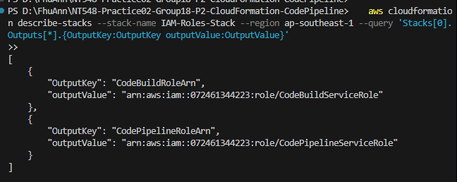
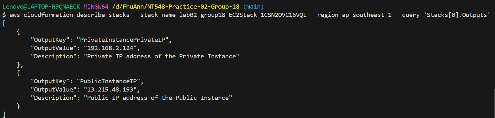
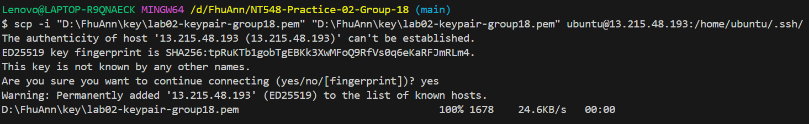
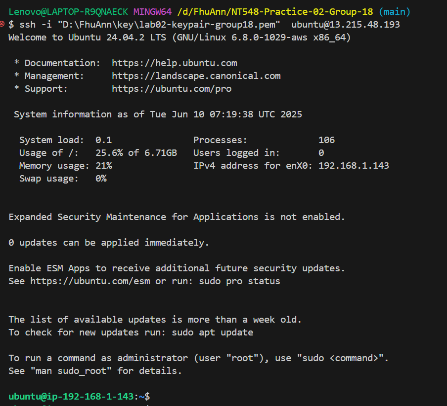
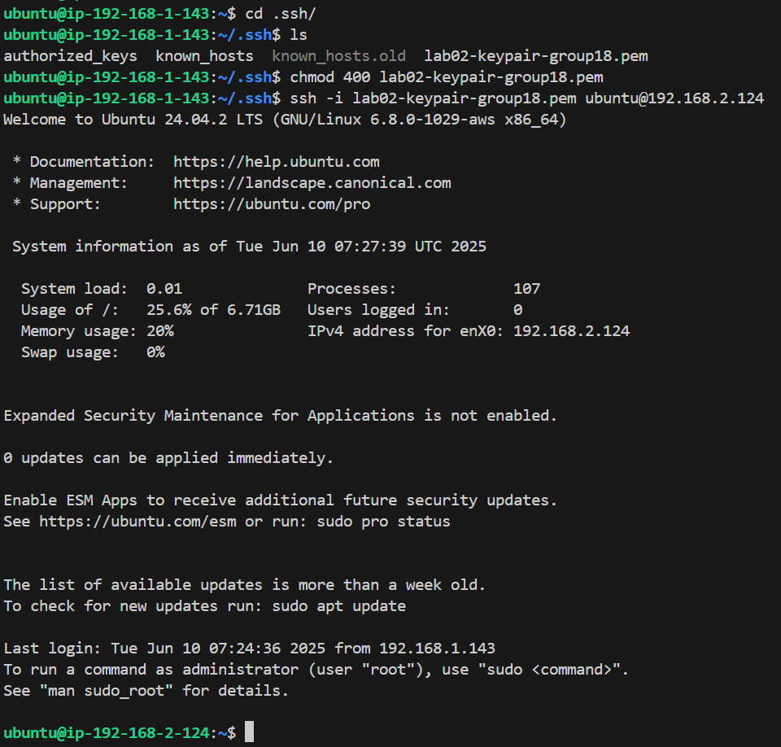

# Lab 2 P2 CloudFormation Guide

## Prerequisites

- AWS Account
- AWS CLI installed and configured

## Steps to Run the Source

1. **Clone the Repository**

   ```sh
   git clone https://github.com/FhuAnn/NT548-Practice02-Group18-P2-CloudFormation-CodePipeline.git
   ```

2. **Create S3 bucket**

   ```sh
   aws s3 mb s3://<you-bucket-name> --region ap-southeast-1
   ```

   Or you can use AWS web interface on AWS Management Console

3. **Create a keypair**

   Go to EC2 Services then create a keypair, **remember** recent created keypair-name

   Store lab02-keypair-group18.pem securely.

4. **Deploy IAM Roles (iam-roles.yaml)**
   ```sh
   aws cloudformation create-stack --stack-name IAM-Roles-Stack --template-body file://iam-roles.yaml --capabilities CAPABILITY_NAMED_IAM --region ap-southeast-1
   ```
   Get roles ARN:

   ```sh
   aws cloudformation describe-stacks --stack-name IAM-Roles-Stack --region ap-southeast-1 --query 'Stacks[0].Outputs[*].{OutputKey:OutputKey outputValue:OutputValue}'
   ```
   Now we can get recent created roles
   

5. **Modify the codebuild-project.yaml**

   ```yaml
        ComputeType: BUILD_GENERAL1_SMALL
        PrivilegedMode: true
      ServiceRole: arn:aws:iam::072461344223:role/CodeBuildServiceRole
      #Replace your code-build-roles-ARN
   ```

6. **Create pipeline connection to Github**

   Access AWSConsole > CodeBuild > Settings> Connections > Create Connection >Select Github Provider > Set connection name > Connect > Copy Arn string

7. **Modify the codepipeline.yaml**

   ```yaml
   Properties:
         Name: taskcat-pipeline
         RoleArn: arn:aws:iam::072461344223:role/CodePipelineServiceRole
      #Replace your code-pipeline-roles-ARN
      ArtifactStore:
        Type: S3
        Location: lab02-group18-bucket
      #Replace your-bucket-name
   ```

   ```yaml
      Configuration:
         ConnectionArn: arn:aws:codestar-connections:ap-southeast-1:072461344223:connection/51fd2a9c-817d-4464-a6ce-bbc8729eb1d4
         #Replace <your-connection-arn>
         FullRepositoryId: FhuAnn/NT548-Practice02-Group18-P2-CloudFormation-CodePipeline
   ```

8. **Deploy CodeBuild project (codebuild-project.yaml)** 

**Create Stacks**
   ```sh
   aws cloudformation create-stack --stack-name CodeBuild-Stack --template-body file://codebuild-project.yaml --region ap-southeast-1
   ```
   Now we should see CodeBuild-Stack created successfully

9. **Deploy CodePipeline (codepipeline.yaml)**

**Create Stacks**
```sh
   aws cloudformation create-stack --stack-name CodePipeline-Stack --template-body file://codepipeline.yaml --region ap-southeast-1
   ```
   Now we should see CodePipeline-Stack created successfully

## Steps to SSH to Instances

1. **Inspect Public Instance IP and Private Instance PrivateIP**

   ```sh
   aws cloudformation describe-stacks --stack-name <your-ec2-stack-name> --region ap-southeast-1 --query 'Stacks[0].Outputs'
   ```

   

2. **Secure copy Private Key to Public Instance**

   ```sh
   scp -i <your-private-key> <your-private-key> ubuntu@<your-public-instance-ip>:/home/ubuntu/.ssh/
   ```

   

   > **Note**: From this step, make sure you are working on a device which IP is allowed (specified in `AllowedSSHIP`)

3. **SSH to Public Instance**

   ```sh
   ssh -i <your-private-key> ubuntu@<your-public-instance-ip>
   ```

   

4. **SSH to Private Instance**

   ```sh
   cd .ssh
   ssh -i <your-private-key> ubuntu@<your-private-instance-privateip>
   ```

   

5. **Destroy**

```sh
    aws cloudformation delete-stack --stack-name lab02-group18 --region ap-southeast-1
```
