# Lab 2 P2 CloudFormation Guide

## Prerequisites

- AWS Account (Can access CodeCommit)
- AWS CLI installed and configured

## Steps to Run the Source

1. **Clone source code from github**

   ```sh
   git clone https://github.com/FhuAnn/NT548-Practice02-Group18-P2-CloudFormation-CodePipeline.git
   ```

2. **Create and clone recent empty repository from CodeCommit**

   Create repository
   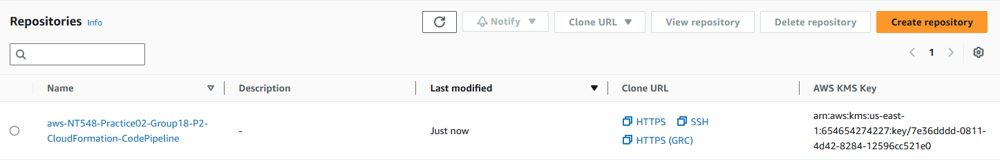

   ```sh
      git clone <your-repo-codecommit-https-clone>
   ```

   A popup to show
   Enter Github credentials in popup (get username-password in **IAM>User>{your-user>Secutiry Credentials>HTTPS Git credentials for AWS CodeCommit>Generate**}) to access to download
   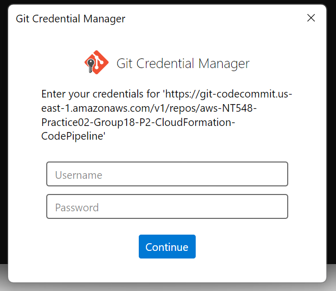

3. **Copy and paste source file to your CodeCommit repository**

   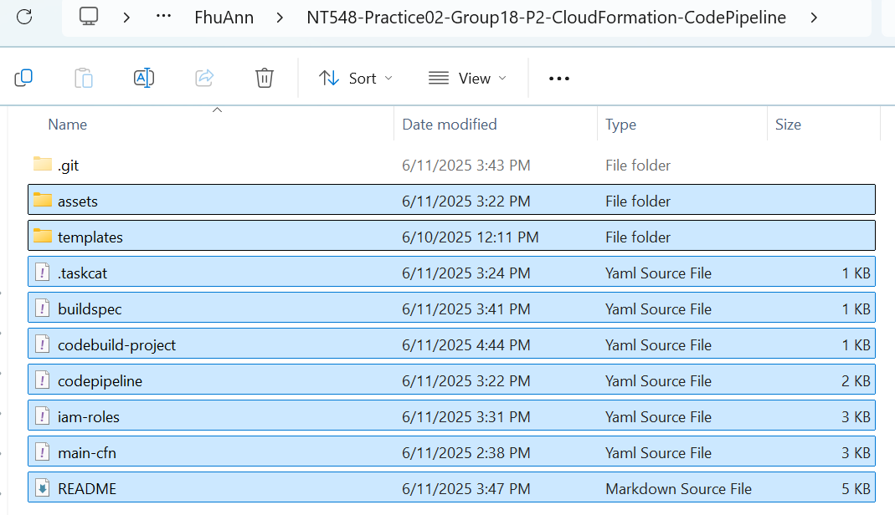

4. **Create S3 bucket**

   ```sh
   aws s3 mb s3://<you-bucket-name> --region us-east-1
   ```

   Or you can use AWS web interface on AWS Management Console

5. **Create a keypair**

   Navigate to the EC2 service, create a new key pair, and note the recently created key pair name.

   Save it to the AWS Secrets Manager.

   Store the lab02-keypair-group18.pem file securely on your local machine.

6. **Deploy IAM Roles (iam-roles.yaml)**

   ```sh
   aws cloudformation deploy --stack-name IAM-Roles-Stack --template-file iam-roles.yaml --capabilities CAPABILITY_NAMED_IAM --region us-east-1
   ```

   Get roles ARN:

   ```sh
   aws cloudformation describe-stacks --stack-name IAM-Roles-Stack --region us-east-1 --query 'Stacks[0].Outputs[*].{OutputKey:OutputKey outputValue:OutputValue}'
   ```

   Now we can get recent created roles
   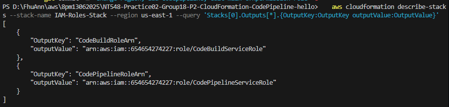

7. **Modify the codebuild-project.yaml** [Click here](codebuild-project.yaml)

   ```yaml
        ComputeType: BUILD_GENERAL1_SMALL
        PrivilegedMode: true
      ServiceRole: arn:aws:iam::654654274227:role/CodeBuildServiceRole
      #Replace your code-build-roles-ARN

   ```

8. **Modify the codepipeline.yaml** [Click here](codepipeline.yaml)

   ```yaml
   Properties:
         Name: taskcat-pipeline
         RoleArn: arn:aws:iam::654654274227:role/CodePipelineServiceRole
      #Replace your code-pipeline-roles-ARN
      ArtifactStore:
        Type: S3
        Location: <your-bucket-name>
      #Replace your-bucket-name
   ```

   ```yaml
      Configuration:
            RepositoryName: <your-codecommit-repo-name> #Replace your codecommit repository name
             BranchName: master
   ```

9. **Deploy CodeBuild project (codebuild-project.yaml)**

   **Create Stacks**

   ```sh
   aws cloudformation deploy --stack-name CodeBuild-Stack  --template-file codebuild-project.yaml --region us-east-1 --capabilities CAPABILITY_NAMED_IAM
   ```

10. **Deploy CodePipeline (codepipeline.yaml)**

    **Create Stacks**

    ```sh
    aws cloudformation deploy --stack-name CodePipeline-Stack  --template-file codepipeline.yaml --region us-east-1 --capabilities CAPABILITY_NAMED_IAM
    ```

    Now we should see **CodePipeline-Stack**, **CodeBuild-Stack**, **taskcat-pipeline**, **taskcat-build** created successfully

    

11. **Push code to CodeCommit repository**

```sh
   git add .
   git commit -m "Initialize first commit - src code"
   git push origin master
```

**The pipeline will be triggered**

## If the pipeline, build, test and deploy are successful, you can view the results

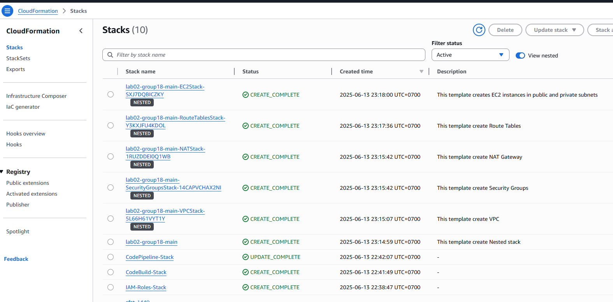

## CodePipeline instance

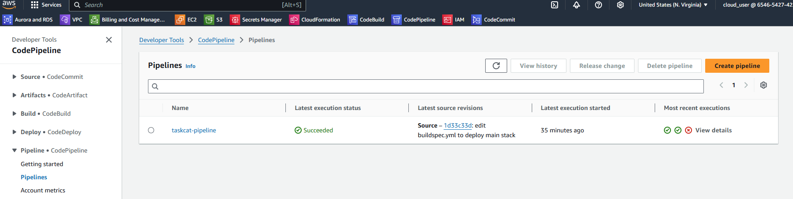

## CodeBuild instance

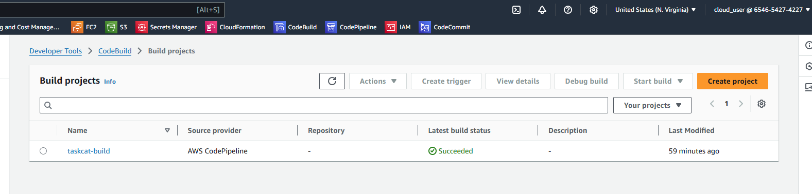

## Steps to SSH to Instances

1. **Inspect Public Instance IP and Private Instance PrivateIP**

   ```sh
      aws cloudformation describe-stacks --stack-name <your-ec2-stack-name> --region us-east-1 --query 'Stacks[0].Outputs'
   ```

   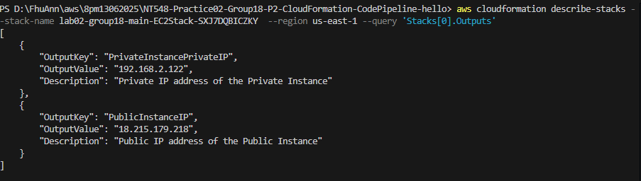

2. **Secure copy Private Key to Public Instance**

   ```sh
   chmod 400 <your-secret-key.pem>
   ```

   ```sh
   scp -i <your-private-key> <your-private-key> ubuntu@<your-public-instance-ip>:/home/ubuntu/.ssh/
   ```

   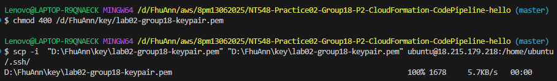

   > **Note**: From this step, make sure you are working on a device which IP is allowed (specified in `AllowedSSHIP`)

3. **SSH to Public Instance**

   ```sh
   ssh -i <your-private-key> ubuntu@<your-public-instance-ip>
   ```

   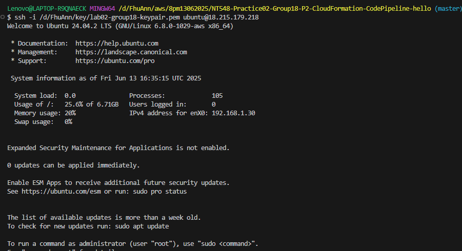

4. **SSH to Private Instance**

   ```sh
   cd .ssh
   chmod 400 <your-secret-key.pem>
   ssh -i <your-private-key> ubuntu@<your-private-instance-privateip>
   ```

   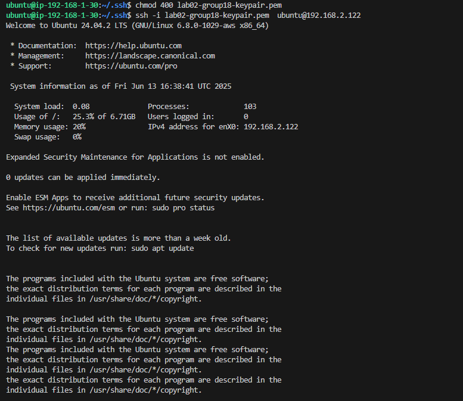

5. **Destroy**

   ```sh
      aws cloudformation delete-stack --stack-name lab02-group18-main --region us-east-1
   ```

## Some utils code

Reset the pipeline to test when there are changes in the repository:

```sh
aws codepipeline start-pipeline-execution --name taskcat-pipeline --region us-east-1
```
